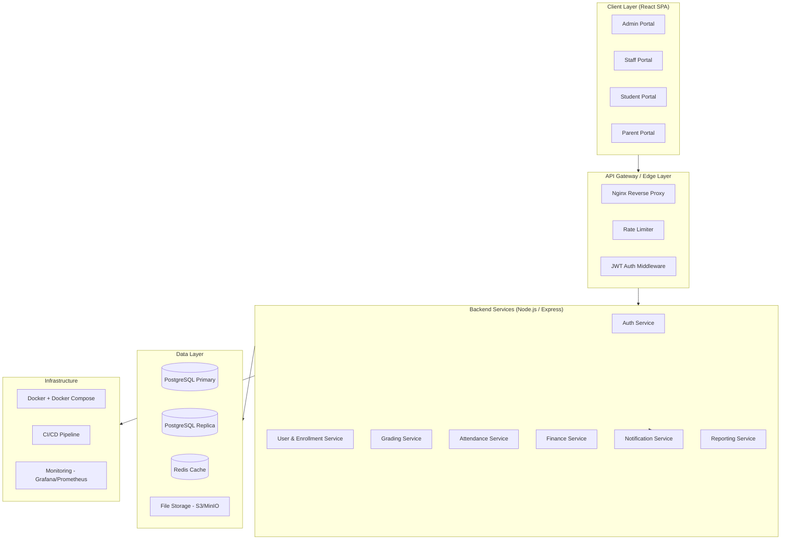
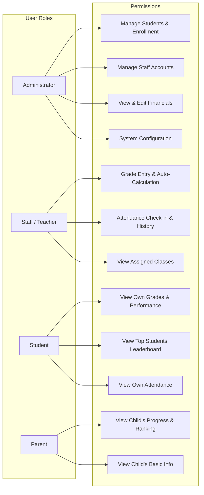
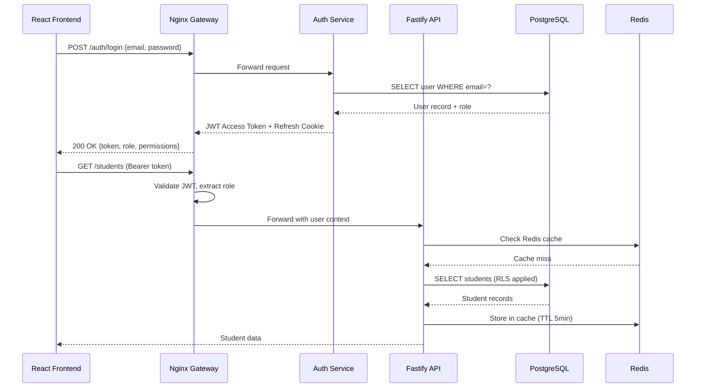
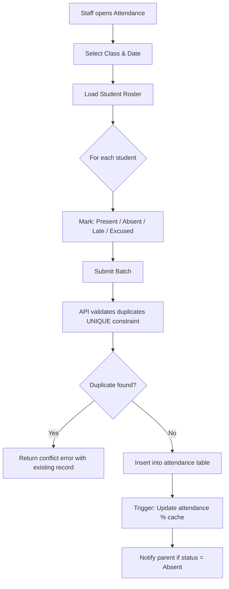

# Base 2 Media Academy — School Management System (SMS)
## Architecture & Design Blueprint

---

## 1. High-Level System Architecture



---

## 2. Role-Based Access Control (RBAC) Model



---

## 3. Key Features by Role

### 🔴 Administrator
| Feature | Description |
|---|---|
| Student Enrollment | Enroll, update, transfer, or withdraw students |
| Profile Management | Full CRUD on student/staff profiles with photo upload |
| Financial Management | Track fees, payments, outstanding balances; generate invoices |
| Dashboard Analytics | Enrollment counts, revenue summaries, attendance heatmaps |
| System Configuration | Manage academic terms, grading scales, class assignments |
| Audit Logs | Full audit trail of all admin actions |

### 🟡 Staff / Teacher
| Feature | Description |
|---|---|
| Grade Entry | Enter raw scores; system auto-calculates letter grade & GPA |
| Bulk Grade Upload | CSV import for batch grading |
| Attendance Tracking | Daily check-in per student (Present / Absent / Late / Excused) |
| Attendance History | Search & filter historical attendance per class |
| Class View | View roster, schedules, and assigned subjects |
| Report Cards | Generate per-student report cards |

### 🟢 Student
| Feature | Description |
|---|---|
| Personal Dashboard | View profile, enrolled courses, term overview |
| Grade Viewer | See grades per subject, overall GPA, and grade trend |
| Performance Charts | Visual charts of academic performance over time |
| Attendance Viewer | View own attendance record with percentage |
| Top Students Board | View ranked leaderboard per class or term |

### 🔵 Parent
| Feature | Description |
|---|---|
| Child's Progress | View grades, GPA, and performance trends |
| Class Ranking | See child's rank within their class |
| Attendance Summary | View child's attendance percentage and absences |
| Basic Info | View child's enrolled courses and term info |
| Notifications | Receive alerts on new grades or low attendance |

---

## 4. Database Design (PostgreSQL)

### Core Schema

```sql
-- USERS (unified table with role discriminator)
CREATE TABLE users (
    id          UUID PRIMARY KEY DEFAULT gen_random_uuid(),
    email       VARCHAR(255) UNIQUE NOT NULL,
    password_hash TEXT NOT NULL,
    role        ENUM('admin','staff','student','parent') NOT NULL,
    is_active   BOOLEAN DEFAULT TRUE,
    created_at  TIMESTAMPTZ DEFAULT NOW(),
    updated_at  TIMESTAMPTZ DEFAULT NOW()
);

-- STUDENT PROFILES
CREATE TABLE student_profiles (
    id            UUID PRIMARY KEY DEFAULT gen_random_uuid(),
    user_id       UUID REFERENCES users(id) ON DELETE CASCADE,
    student_id    VARCHAR(20) UNIQUE NOT NULL,  -- e.g. B2MA-2024-001
    first_name    VARCHAR(100) NOT NULL,
    last_name     VARCHAR(100) NOT NULL,
    date_of_birth DATE,
    gender        VARCHAR(10),
    photo_url     TEXT,
    address       TEXT,
    phone         VARCHAR(20),
    enrollment_date DATE NOT NULL,
    status        ENUM('active','inactive','graduated','withdrawn') DEFAULT 'active',
    class_id      UUID REFERENCES classes(id),
    created_at    TIMESTAMPTZ DEFAULT NOW()
);

-- PARENT PROFILES
CREATE TABLE parent_profiles (
    id          UUID PRIMARY KEY DEFAULT gen_random_uuid(),
    user_id     UUID REFERENCES users(id) ON DELETE CASCADE,
    first_name  VARCHAR(100),
    last_name   VARCHAR(100),
    phone       VARCHAR(20),
    student_id  UUID REFERENCES student_profiles(id)  -- linked child
);

-- STAFF PROFILES
CREATE TABLE staff_profiles (
    id          UUID PRIMARY KEY DEFAULT gen_random_uuid(),
    user_id     UUID REFERENCES users(id) ON DELETE CASCADE,
    staff_id    VARCHAR(20) UNIQUE NOT NULL,
    first_name  VARCHAR(100) NOT NULL,
    last_name   VARCHAR(100) NOT NULL,
    department  VARCHAR(100),
    phone       VARCHAR(20),
    photo_url   TEXT,
    hire_date   DATE
);

-- ACADEMIC TERMS
CREATE TABLE terms (
    id          UUID PRIMARY KEY DEFAULT gen_random_uuid(),
    name        VARCHAR(100) NOT NULL,  -- e.g. "Term 1 2024"
    start_date  DATE NOT NULL,
    end_date    DATE NOT NULL,
    is_current  BOOLEAN DEFAULT FALSE
);

-- CLASSES
CREATE TABLE classes (
    id          UUID PRIMARY KEY DEFAULT gen_random_uuid(),
    name        VARCHAR(100) NOT NULL,   -- e.g. "Grade 10A"
    term_id     UUID REFERENCES terms(id),
    capacity    INT DEFAULT 40,
    created_at  TIMESTAMPTZ DEFAULT NOW()
);

-- SUBJECTS
CREATE TABLE subjects (
    id          UUID PRIMARY KEY DEFAULT gen_random_uuid(),
    name        VARCHAR(100) NOT NULL,
    code        VARCHAR(20) UNIQUE NOT NULL,
    description TEXT
);

-- CLASS-SUBJECT ASSIGNMENTS (many-to-many with teacher)
CREATE TABLE class_subjects (
    id          UUID PRIMARY KEY DEFAULT gen_random_uuid(),
    class_id    UUID REFERENCES classes(id),
    subject_id  UUID REFERENCES subjects(id),
    staff_id    UUID REFERENCES staff_profiles(id),
    term_id     UUID REFERENCES terms(id),
    UNIQUE(class_id, subject_id, term_id)
);

-- GRADES
CREATE TABLE grades (
    id              UUID PRIMARY KEY DEFAULT gen_random_uuid(),
    student_id      UUID REFERENCES student_profiles(id),
    class_subject_id UUID REFERENCES class_subjects(id),
    score           NUMERIC(5,2) NOT NULL,       -- raw score (0-100)
    letter_grade    VARCHAR(5) GENERATED ALWAYS AS (  -- auto-calculated
        CASE
            WHEN score >= 90 THEN 'A+'
            WHEN score >= 80 THEN 'A'
            WHEN score >= 70 THEN 'B'
            WHEN score >= 60 THEN 'C'
            WHEN score >= 50 THEN 'D'
            ELSE 'F'
        END
    ) STORED,
    grade_points    NUMERIC(3,2) GENERATED ALWAYS AS (
        CASE
            WHEN score >= 90 THEN 4.0
            WHEN score >= 80 THEN 3.7
            WHEN score >= 70 THEN 3.0
            WHEN score >= 60 THEN 2.0
            WHEN score >= 50 THEN 1.0
            ELSE 0.0
        END
    ) STORED,
    remarks         TEXT,
    recorded_by     UUID REFERENCES staff_profiles(id),
    recorded_at     TIMESTAMPTZ DEFAULT NOW(),
    updated_at      TIMESTAMPTZ DEFAULT NOW()
);

-- ATTENDANCE
CREATE TABLE attendance (
    id          UUID PRIMARY KEY DEFAULT gen_random_uuid(),
    student_id  UUID REFERENCES student_profiles(id),
    class_id    UUID REFERENCES classes(id),
    date        DATE NOT NULL,
    status      ENUM('present','absent','late','excused') NOT NULL,
    checked_by  UUID REFERENCES staff_profiles(id),
    notes       TEXT,
    created_at  TIMESTAMPTZ DEFAULT NOW(),
    UNIQUE(student_id, class_id, date)
);

-- FINANCIALS
CREATE TABLE fee_structures (
    id          UUID PRIMARY KEY DEFAULT gen_random_uuid(),
    term_id     UUID REFERENCES terms(id),
    class_id    UUID REFERENCES classes(id),
    description TEXT NOT NULL,
    amount      NUMERIC(10,2) NOT NULL
);

CREATE TABLE payments (
    id              UUID PRIMARY KEY DEFAULT gen_random_uuid(),
    student_id      UUID REFERENCES student_profiles(id),
    fee_structure_id UUID REFERENCES fee_structures(id),
    amount_paid     NUMERIC(10,2) NOT NULL,
    payment_date    DATE NOT NULL,
    method          ENUM('cash','bank_transfer','mobile_money','card'),
    reference       VARCHAR(100),
    recorded_by     UUID REFERENCES users(id),
    created_at      TIMESTAMPTZ DEFAULT NOW()
);

-- AUDIT LOGS
CREATE TABLE audit_logs (
    id          BIGSERIAL PRIMARY KEY,
    user_id     UUID REFERENCES users(id),
    action      VARCHAR(100) NOT NULL,
    table_name  VARCHAR(100),
    record_id   UUID,
    old_data    JSONB,
    new_data    JSONB,
    ip_address  INET,
    created_at  TIMESTAMPTZ DEFAULT NOW()
);
```

### Performance Indexes
```sql
-- Hot query paths
CREATE INDEX idx_grades_student_term    ON grades(student_id, class_subject_id);
CREATE INDEX idx_attendance_student_date ON attendance(student_id, date DESC);
CREATE INDEX idx_attendance_class_date  ON attendance(class_id, date DESC);
CREATE INDEX idx_payments_student       ON payments(student_id, payment_date DESC);
CREATE INDEX idx_audit_logs_user_time   ON audit_logs(user_id, created_at DESC);
CREATE INDEX idx_student_profiles_class ON student_profiles(class_id, status);

-- GPA Materialized View for leaderboard (refreshed nightly or on grade update)
CREATE MATERIALIZED VIEW student_gpa_summary AS
SELECT
    sp.id AS student_id,
    sp.first_name || ' ' || sp.last_name AS full_name,
    sp.class_id,
    t.id AS term_id,
    ROUND(AVG(g.grade_points), 2) AS gpa,
    COUNT(g.id) AS subjects_graded,
    RANK() OVER (PARTITION BY sp.class_id, t.id ORDER BY AVG(g.grade_points) DESC) AS class_rank
FROM student_profiles sp
JOIN grades g ON g.student_id = sp.id
JOIN class_subjects cs ON cs.id = g.class_subject_id
JOIN terms t ON t.id = cs.term_id
GROUP BY sp.id, sp.class_id, t.id;

CREATE UNIQUE INDEX ON student_gpa_summary (student_id, term_id);
```

---

## 5. Technology Stack

### Frontend
| Layer | Technology | Reason |
|---|---|---|
| Framework | **React 18 + TypeScript** | Component-based, type-safe |
| Routing | **React Router v6** | Nested role-based routes |
| State | **Zustand + React Query (TanStack)** | Server state + local state |
| UI Components | **shadcn/ui + Radix UI** | Accessible, headless components |
| Charts | **Recharts** | Grade/attendance visualizations |
| Forms | **React Hook Form + Zod** | Validation & performance |
| Styling | **CSS Modules + CSS Variables** | Scoped, themeable styles |
| Build Tool | **Vite** | Sub-second HMR, fast builds |

### Backend
| Layer | Technology | Reason |
|---|---|---|
| Runtime | **Node.js 20 LTS** | Non-blocking I/O, npm ecosystem |
| Framework | **Fastify** | 2x faster than Express, schema validation |
| Auth | **JWT + Refresh Tokens** | Stateless, scalable sessions |
| ORM | **Drizzle ORM** | Type-safe SQL, lightweight |
| Validation | **Zod** | Shared schemas with frontend |
| Queue | **BullMQ (Redis)** | Async notifications & report generation |
| Mailer | **Nodemailer + SMTP** | Email notifications |

### Data & Infrastructure
| Layer | Technology | Reason |
|---|---|---|
| Database | **PostgreSQL 16** | ACID, JSON support, generated columns |
| Cache | **Redis 7** | Session store, leaderboard cache |
| File Storage | **MinIO (S3-compatible)** | Profile photos, documents |
| Containerization | **Docker + Docker Compose** | Consistent environments |
| Reverse Proxy | **Nginx** | SSL termination, load balancing |
| Monitoring | **Grafana + Prometheus** | Real-time metrics & alerts |
| CI/CD | **GitHub Actions** | Automated tests & deployments |

---

## 6. Security Architecture

### Authentication & Authorization
- **JWT Access Tokens** (15-min expiry) + **HTTP-only Refresh Tokens** (7-day, stored in cookie)
- **Role + Permission middleware** on every API route — no frontend-only guards
- **RBAC enforced at DB level** via row-level security (RLS) policies in PostgreSQL

### Data Protection
- **Bcrypt** (cost factor 12) for password hashing
- **TLS 1.3** enforced on all connections (Nginx)
- **Database connection pooling** via PgBouncer (max 100 connections)
- **Parameterized queries only** — no raw SQL concatenation (Drizzle ORM enforced)
- **CORS whitelist** — only known frontend origins allowed

### Operational Security
- **Rate limiting**: 100 req/min per IP on public routes, 300 req/min for authenticated
- **Audit logging**: Every data mutation logged with `user_id`, `ip_address`, and `old/new data`
- **Input sanitization**: Zod schema validation on all API inputs
- **File upload restrictions**: MIME-type validation, max 5MB, virus scan hook
- **Environment secrets**: Stored in `.env` files, never in source control; use Docker secrets in production

---

## 7. System Architecture Flow



---

## 8. Attendance Auto-Check-In Flow



---

## 9. Automatic Grade Calculation

Grades are computed using **PostgreSQL generated columns** — no application-layer calculation needed:

```
Score Range → Letter Grade → Grade Points
90 – 100    →     A+       →    4.0
80 – 89     →     A        →    3.7
70 – 79     →     B        →    3.0
60 – 69     →     C        →    2.0
50 – 59     →     D        →    1.0
 0 – 49     →     F        →    0.0

GPA = AVG(grade_points) across all subjects per term
Class Rank = RANK() OVER (PARTITION BY class ORDER BY GPA DESC)
```

The `student_gpa_summary` materialized view is **automatically refreshed** via a PostgreSQL trigger on `grades` INSERT/UPDATE, keeping leaderboards up-to-date in real time.

---

## 10. Proposed Project Structure

```
base2media-sms/
├── frontend/                   # React + Vite App
│   ├── src/
│   │   ├── features/
│   │   │   ├── admin/          # Admin portal pages & components
│   │   │   ├── staff/          # Staff portal pages & components
│   │   │   ├── student/        # Student portal pages & components
│   │   │   └── parent/         # Parent portal pages & components
│   │   ├── components/         # Shared UI components
│   │   ├── lib/                # API client, utilities, auth
│   │   ├── hooks/              # Custom React hooks
│   │   └── store/              # Zustand stores
│   └── public/
│
├── backend/                    # Fastify API
│   ├── src/
│   │   ├── routes/             # Route handlers per domain
│   │   ├── services/           # Business logic
│   │   ├── db/                 # Drizzle schema & migrations
│   │   ├── middleware/         # Auth, RBAC, rate limiting
│   │   └── workers/            # BullMQ background jobs
│   └── drizzle/                # DB migration files
│
├── docker-compose.yml          # PostgreSQL, Redis, MinIO, App
├── nginx/nginx.conf            # Reverse proxy config
└── .github/workflows/          # CI/CD pipeline
```

---

## Open Questions

> [!IMPORTANT]
> **Academic Grading Scale**: The grading thresholds above (90=A+, 80=A, etc.) are configurable. Should Base 2 Media Academy use a custom grading scale?

> [!IMPORTANT]
> **Deployment Target**: Will this be hosted on a VPS (e.g., DigitalOcean/Linode), a cloud provider (AWS/GCP), or on-premise server? This impacts the infrastructure choices.

> [!NOTE]
> **SMS/WhatsApp Notifications**: Should parent notifications go beyond email — e.g., via WhatsApp Business API or SMS gateway (Twilio)?

> [!NOTE]
> **Multi-Campus Support**: Does Base 2 Media Academy have or plan multiple campuses that need to be managed under one system?
